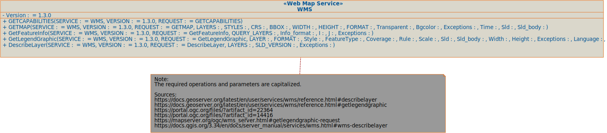
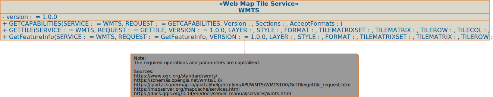
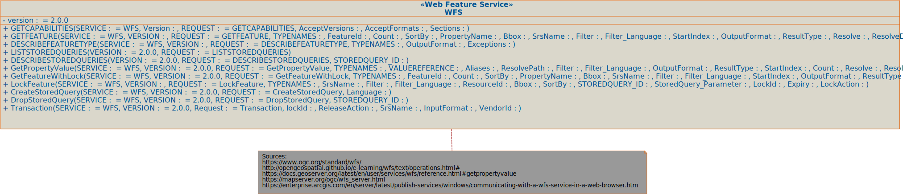

# Geo Web Services 

==Right click on the (SVG) images and open them in a new window to see them in full size.==

## Web Map Service 
WMS / version 1.3.0

[WMS Code Template in Python](generated-code/WMS.py)

## Web Map Tile Service
WMTS / version 1.0.0

[WMTS Code Template in Python](generated-code/WMTS.py)

## Web Feature Service
WFS / version 2.0.0

[WFS Code Template in Python](generated-code/WFS.py)

