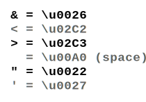

# YAML Cheatsheet

## Links

[onlineyamltools.com](https://onlineyamltools.com)

## Tricks

How to escape special characters in a string?

### HTML Entity Escape

[Reserved Characters - Mozilla Developer](https://developer.mozilla.org/en-US/docs/Glossary/Entity#reserved_characters) 

### Unicode Escape

[Unicode Characters Table - Rapid Tables](https://www.rapidtables.com/code/text/unicode-characters.html)
