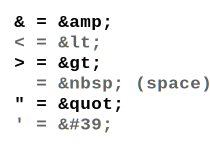

# YAML Cheatsheet

## Links

[onlineyamltools.com](https://onlineyamltools.com)

## Characters and Rules Table

 Relevant Character(s) | Rule(z) | Note 
---|---|---
 No more spaces! |  |  
 # (hashtag) | for single line commenting |  
 true / false | returns boolean | yes / no , on / off 
 - (hypen/dash+space) | for creating sequences (list member) |  
 [1, 2, 3] (square bracket) | also works for creating lists |  
 (pipe) | used to write multiline strings and to keep as multline string |  
 > (greater than) | used to write multiline strings and to converts it to single line string |  
 $ (dollar) | forwards environment variable into strings |  
 {{ }} (double curly bracket) | placeholder |  
 --- (three dash) | used as seperator in multi documents |  
 & (ampersand) | used to declare an object as anchor (like pointers) |  
 * (asteriks) | used to call the object with anchor with the same name (called as alias) |  
 <<: (x2 less than+colon) | refers to an object called with an alias, it is possible to override the predefined attribute. |  
 !!str / !!int / !!bool | data type casting | 

## Tricks

How to escape special characters in a string?

### HTML Entity Escape

[Reserved Characters - Mozilla Developer](https://developer.mozilla.org/en-US/docs/Glossary/Entity#reserved_characters) 

### Unicode Escape

[Unicode Characters Table - Rapid Tables](https://www.rapidtables.com/code/text/unicode-characters.html)
